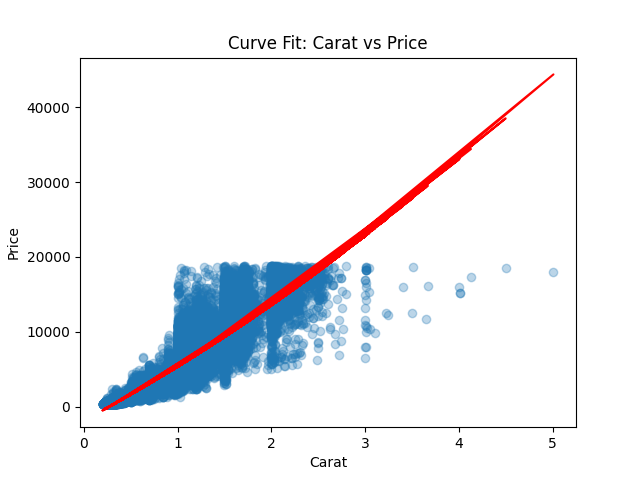
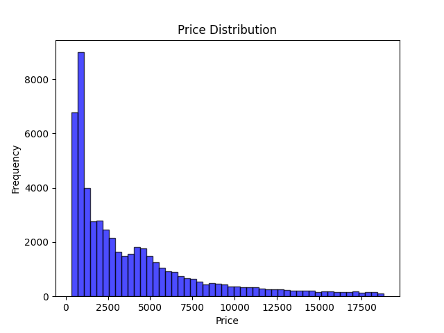
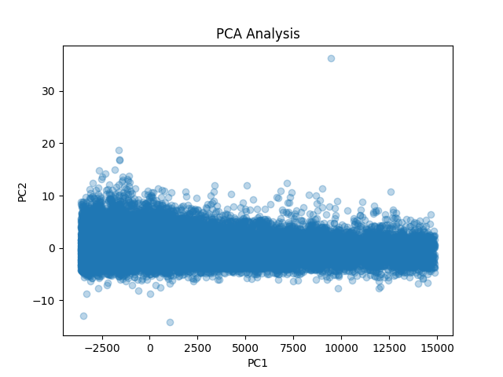
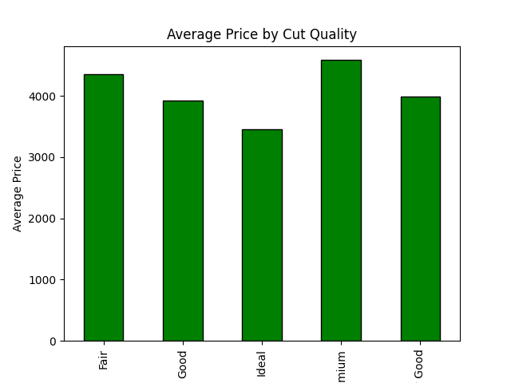
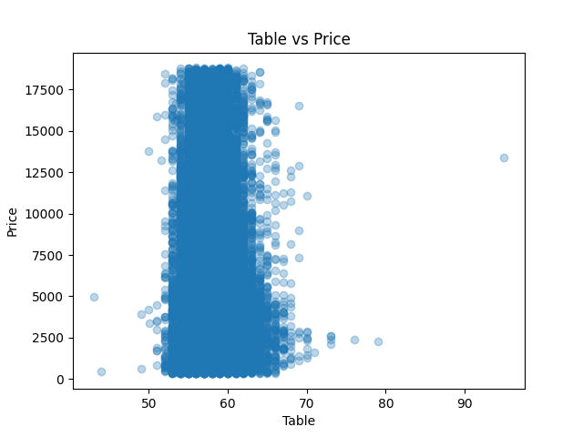
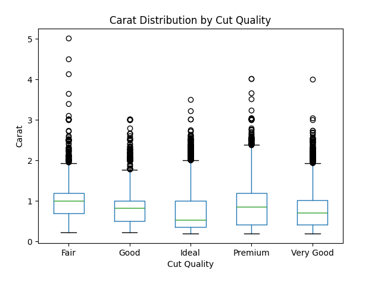

# Data Science Analysis Report

## Introduction
This project analyzes the diamonds dataset using data science techniques such as curve fitting, distribution testing, and principal component analysis (PCA). The key questions investigated are:

1. **How does carat affect price?**
2. **Is the price distribution normal?**
3. **What are the principal components of the dataset?**

Additionally, we follow up with:

4. **How does cut quality impact price?**
5. **What is the correlation between table and price?**
6. **How does carat weight compare across different cut qualities?**

## Source
[seaborn-data by mwaskom | Github](https://github.com/mwaskom/seaborn-data)

## Findings

### 1. How does carat affect price?
A quadratic model was fitted, revealing a strong non-linear relationship between carat and price. Higher carat diamonds tend to be significantly more expensive.

### 2. Is the price distribution normal?
The Shapiro-Wilk test resulted in a very low p-value, indicating that price is not normally distributed. The histogram confirms the skewed distribution with a long tail on higher prices.

### 3. What are the principal components of the dataset?
PCA revealed that most variance is explained by the first two components, with carat and price heavily influencing PC1.

### 4. How does cut quality impact price?
Higher cut qualities tend to have higher average prices, with the highest-quality cuts demanding a premium price.

### 5. What is the correlation between table and price?
The correlation between table and price was found to be weak. The scatter plot shows no strong linear trend, suggesting table size does not significantly affect price.

### 6. How does carat weight compare across different cut qualities?
The box plot indicates that lower-quality cuts tend to have higher carat weights. This suggests that premium cuts are often applied to smaller diamonds for maximum brilliance.

## Conclusion
This analysis highlights the significant role of carat weight and cut quality in determining diamond prices. PCA provided insights into key influential features, while statistical tests confirmed the non-normal distribution of prices.
